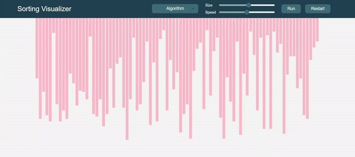

# Sorting Visualizer
I built this simple JavaScript app to visualize classic sorting algorithms! 

The tool allows to visualize 11 different algorithms:

1. Bubble Sort
2. Coctail Sort
3. Comb Sort
4. Gnome Sort
5. Heap Sort
6. Insertion Sort
7. Merge Sort
8. Quick Sort
9. Radix Sort
10. Selection Sort
11. Shell Sort

### Bubble Sort Visualization:

## Instalation

The app is hosted here: https://mfijalkowska.github.io/Sorting-Visualizer/. Give it a go!

However, if you wish to run this app locally, clone this repo.

```
$ git clone https://github.com/mfijalkowska/Sorting-Visualizer.git
```
